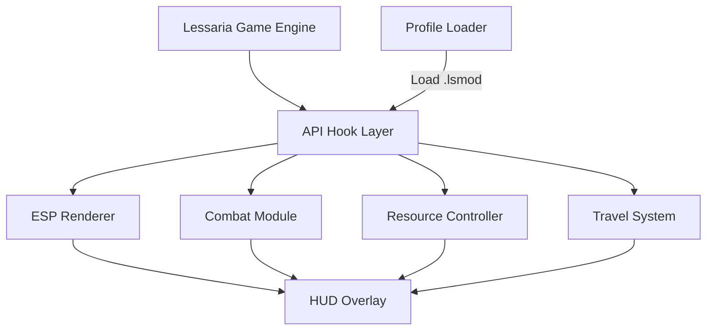

# Lessaria Mod Menu 🌒

Venture into the mystical world of **Lessaria** with full control at your fingertips. The **Lessaria Mod Menu** is an advanced, fully modular overlay designed for players who seek tactical flexibility and refined gameplay tuning. From environmental visualization to combat and economy tweaks, it gives you command over every quest, encounter, and discovery.

Streamlined, stable, and highly customizable — this Mod Menu lets you shape the world of Lessaria to match your style of adventure.

---

## 🧭 Overview

Unlike typical trainers, **Lessaria Mod Menu** integrates as an intelligent control layer that interacts with live gameplay metrics — reading combat states, player stats, and environmental conditions without directly altering game files.

You can visualize loot zones, modify movement flow, or balance stamina and mana in real time, creating a personalized adventure system that evolves with you.

---

## ⚙️ Core Features

* **👁 ESP Overlay:** See enemies, resources, treasures, and NPCs through terrain in real time.
* **⚔️ Combat Tweaker:** Adjust attack speed, dodge cooldown, and stamina drain.
* **💨 Fast Travel Gateway:** Instantly teleport between discovered shrines or regions.
* **🌙 Environmental Control:** Toggle weather, time of day, and visibility filters.
* **📜 Quest Tracker Overlay:** Pin active objectives on your HUD with directional hints.
* **💾 Modular Profiles:** Save and load `.lsmod` configuration files for each character or campaign.
* **🧩 Resource Manager:** Modify gold caps, crafting materials, and loot probabilities for testing or roleplay.

[!IMPORTANT]
All systems run externally — no scripts or code are injected into Lessaria’s process. Safe for story, sandbox, and modded saves.

---

## 🧠 Compatibility

| System        | Support | Notes                                      |
| ------------- | ------- | ------------------------------------------ |
| Windows 10    | ✅       | DX11 & DX12 optimized                      |
| Windows 11    | ✅       | Stable frame pacing support                |
| Steam Edition | ✅       | Auto-detect enabled                        |
| Epic Edition  | ⚠️      | Manual attach path required                |
| Vulkan Mode   | ⚠️      | Use `--vk-hook=on` for experimental builds |
| Cloud Saves   | ✅       | Compatible; doesn’t affect files           |

> 💡 *Accessibility:* Colorblind palettes, text scaling, and contrast filters available for visual comfort.

---

## 🚀 Setup Guide

1. **Extract** the Mod Menu into a dedicated folder (e.g., `C:\LessariaMod`).
2. **Launch the game**, wait for your world to load.
3. **Run the Mod Menu as Administrator:**

   ```bash
   LessariaModMenu.exe --attach --safe
   ```
4. Press **F8** to open the overlay.
5. Enable modules (ESP, Combat, Travel, Weather) and adjust sliders to preference.
6. Save your configuration for future sessions.

**Example Advanced Launch Command:**

```bash
LessariaModMenu.exe --profile=NightWalker --frametime-sync --dx=12
```

[!NOTE]
If overlays appear misaligned, switch to **Borderless Windowed Mode** for perfect rendering accuracy.

---

## 🧩 Config Presets

**1. Night Walker (Stealth Build)**

```ini
[combat]
attack_speed=1.1
stamina_drain=0.7
dodge_cooldown=0.85

[esp]
enemy_color=#FF4040
loot_color=#FFD700
npc_outline=on
fog_density=0.5
```

**2. Explorer’s Insight**

```ini
[visual]
time_of_day=dawn
weather=clear
map_highlights=on
poi_radar=on
hud_opacity=0.9
```

**3. Resource Manager Mode**

```ini
[resources]
gold_multiplier=2.0
crafting_drop_rate=1.5
inventory_weight_limit=unlimited
```

---

## 🗺 Flow Diagram



Each module works asynchronously — allowing ESP and combat tweaks to run smoothly even during high-action scenes.

---

## 🔧 Advanced Flags

| Flag               | Description                                  |
| ------------------ | -------------------------------------------- |
| `--safe`           | Non-invasive overlay rendering               |
| `--dx=12`          | Forces DX12 render mode                      |
| `--vk-hook=on`     | Enables Vulkan compatibility                 |
| `--frametime-sync` | Synchronizes overlay with frame presentation |
| `--eco`            | Low-power overlay mode                       |
| `--profile=NAME`   | Loads saved `.lsmod` profile                 |

[!WARNING]
Avoid using **ESP Overlay** and **Resource Radar** simultaneously in 4K fullscreen — may cause brief render delay on lower-end GPUs.

---

## ❓ FAQ

**Q1: Does the Mod Menu alter game difficulty or story?**
A: No — it only enhances data visibility and adjusts parameters temporarily.

**Q2: Will it interfere with community mods?**
A: It’s compatible with texture, model, and quest mods. Only affects live game overlay.

**Q3: Can I use it in co-op sessions?**
A: The overlay data is client-only — safe to use without syncing changes to others.

**Q4: Is it safe for achievements?**
A: Yes, it doesn’t flag achievement systems since it avoids memory modification.

**Q5: Can I remap controls?**
A: Yes. All hotkeys are customizable under *Input Settings* within the Mod Menu.

---

## 🧩 Recommended Profiles

* **Night Walker:** Stealth and precision overlays for nighttime hunting.
* **Explorer:** High-contrast visuals, clear map highlights, and fast travel enabled.
* **Wealth Master:** Adjusted loot probabilities and economy multipliers for trading runs.

Switch via:

```bash
LessariaModMenu.exe --profile=Explorer
```

---

## 🌒 Final Thoughts

The **Lessaria Mod Menu** gives adventurers a smarter, cleaner way to experience the world — balancing immersion with insight. From combat optimization to visual tracking, every feature is engineered to amplify performance and situational awareness without breaking the fantasy.

Play your way. Shape your world. Rule Lessaria on your terms.
